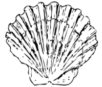

.. image:: https://readthedocs.org/projects/clamm/badge/?version=latest

.. inclusion-marker-do-not-remove

README
======

*the classical music manager you never knew you needed, until now...*

``clamm`` is a python command line program for managing (and growing) a library of classical music.

* efficiently maps the tags of classical music audio files to sane structures.
* provides tools for working with raw audio streams of (you guessed it!) classical music
* generate playlists using iTunes-like combination logic.

INSTALLATION
^^^^^^^^^^^^

Most (if not all) of the software listed below can be installed using common package managers like brew, apt, pacman, yum, ...

``clamm`` functionality is broken into two main categories, Managing and Adding.

The dependencies for organizing and building a library are

1. ffmpeg_ for audio stream conversion and other low-level audio utilities

2. flac_ for ``metaflac`` which enables tagging FLAC files

The dependencies for adding to a library require macOS first of all. Also,

1. shairport-sync_ for capturing raw PCM data from iTunes

2. osascript_ for controlling iTunes

FAQ
^^^

Aren't there libraries that do this already?
''''''''''''''''''''''''''''''''''''''''''''

There are already several good music library tools on the market. The best I am aware of is probably is beets_. ``beets`` has great support for interfacing with the open-source tag database musicbrainz_ as well a host of library management functionality and a rich plugin ecosphere. Indeed, ``clamm`` aspires to be like ``beets`` when it grows up.

I tried beets and still have a use for it, but it didn't have the support for classical music tags I wanted. In fairness, beets relies heavily on musicbrainz, and musicbrainz reflects all other audio file tag schemas in skewing toward popular music.

.. _beets: http://beets.io/
.. _musicbrainz: https://musicbrainz.org/ database
.. _ffmpeg: https://github.com/FFmpeg/FFmpeg
.. _flac: https://xiph.org/flac/
.. _shairport-sync: https://github.com/mikebrady/shairport-sync
.. _osascript: https://developer.apple.com/legacy/library/documentation/Darwin/Reference/ManPages/man1/osascript.1.html

